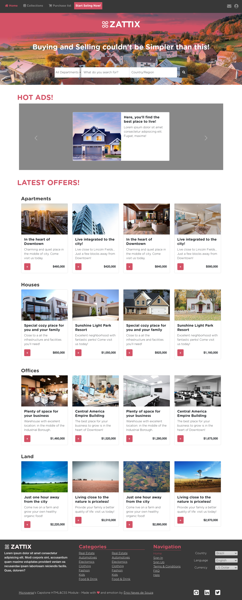
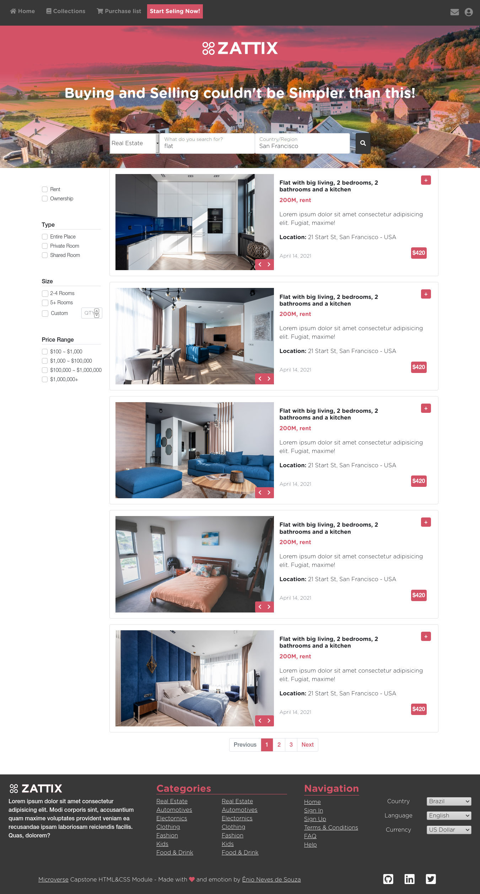

# Capstone Project - HTML&CSS Module

> This is my Capstone Project for Microverse Software Development Program.
> My goal was to build a page similar to [this one](https://www.behance.net/gallery/24796463/ZATTIX), from [Behance](https://www.behance.net/). Two pages have been built: a home page and a search results page. Their screenshots are presented below:

#### This is a screenshot of the home page:

#### This is a screenshot of the search results page:

## Built With

- HTML5
- CSS3
  - Sass
  - CSS Framework (Bootstrap 5)

## Live Demo

[Live Demo Link](https://enionsouza.github.io/zattix-shop/)

## Getting Started

To properly visualize this project on your computer, please [Download](https://github.com/enionsouza/zattix-shop/archive/refs/heads/main.zip) this repo files and open the _index.html_ file in any browser of your preference. You may also prefer to use `git clone git@github.com:enionsouza/zattix-shop.git` on your command line terminal and clone this project. Please, feel free to do so!

Please, also notice that:

- On the home page, the "search" button is a link for the search results page;
- On the search results page, the "home" link will return to the home page.

## Author:

👤 **Ênio Neves de Souza**

- GitHub: [@enionsouza](https://github.com/enionsouza/)
- Twitter: [@enionsouza](https://twitter.com/enionsouza)
- LinkedIn: [LinkedIn](https://www.linkedin.com/in/enio-neves-de-souza/)

## 🤝 Contributing

Contributions, issues, and feature requests are welcome!

## Show your support

Give a ⭐️ if you like this project!

## 📝 License

# License

This project is [MIT](https://opensource.org/licenses/MIT) licensed.
